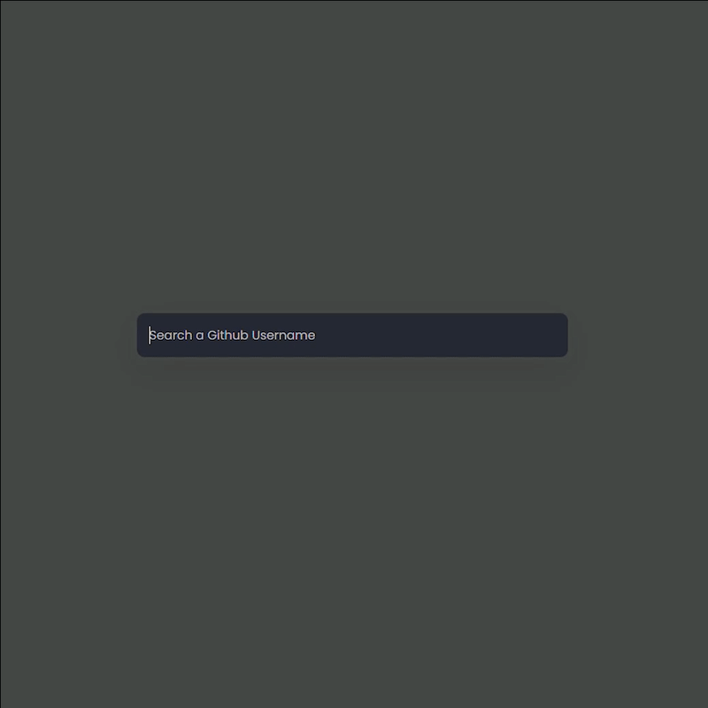

# Github Cardss

A JavaScript webapp to fetch a GitHub card for your profile. It uses the [GitHub API](https://docs.github.com/rest) to retrieve data about your profile.

## Features 📦

- Username
- Bio
- Followers / Following / Repo count
- Individual repo links

## Usage 🌐

1. Go to the [Website Demo Link](https://githubcardss.netlify.app)
2. Enter your GitHub username (e.g. `mohitjaisal`).
3. Hit Enter and your GitHub card will be generated below!

## Gallery 🖼️

A picture is worth a thousand words:

## :heart: Contribution

If you want to contribute to the project, the first thing you need to do is create an issue with the problem/future that you want to add. When you are assigned (meaning the issue has been approved) you can fork this repo and begin working on the project.

When you are done, you can create a pull request explaining what you've done and what issue you are closing (adding a reference to it).

After that, if your PR follows the code style and fix or add something to the project will be merged inside the project.
